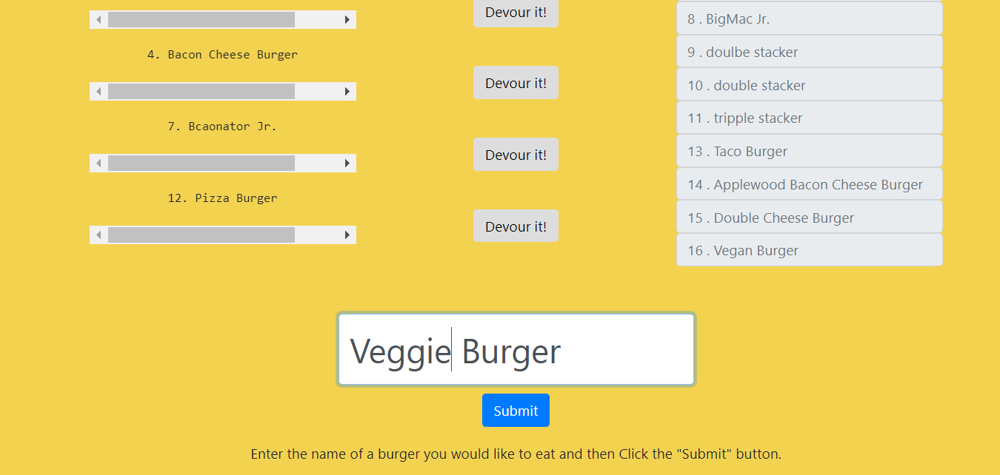
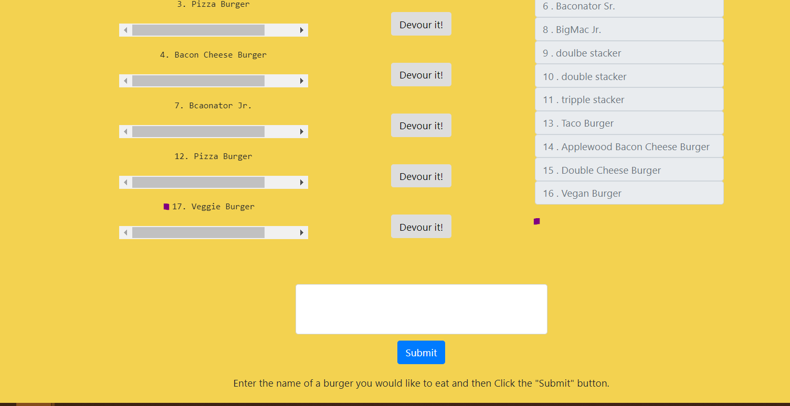
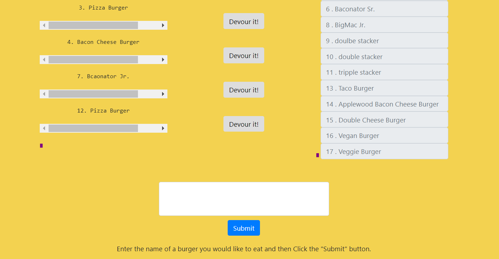

# Burger
  This is a restaurnat application that allows the user to input the name of a burger they would like to eat and eat it by using the submit button. After submiting the form, the sql database will stored the information inputted by the user, then it will show the result on the left side of the page. After clicking on the devour button, the database will be updated and the name of the eaten burger will be sidplayed on the left side of the application. 
## Technologies Used:
* [MySQL](https://www.npmjs.com/package/mysql)
* [Node](https://www.npmjs.com/package/node-spotify-api)
* [Express](https://npmjs.com/package/express)
* [Handlebars](https://www.npmjs.com/package/handlebars)
* [Express](https://npmjs.com/package/express)

## How to use the Burger restaurant app<h3>
 1. Start by typing the name of a burger on the form. Then submit the request.
  
  
 2. After submitting your request, the burger to be eaten will show up on the left side of the page. In order to eat it, click on the devour button.
  
  
 3. Once the devour button is clicked the eaten burger will be displayed on the right side of the page. 
  

## Link to demo:
* For a demo of the application please refer to the following [Burger](#) link.
